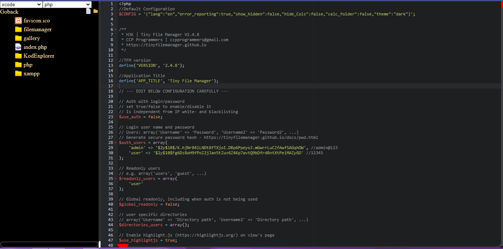

## CodeEditor
Hey Folks this is Simple Web Based Code Editor , No Need To use Nano or vim for your server now.
Simply put it in the public Directory and enjoy. 


### How To

1. To Go Change Permissions to Read Only Mode.
 - Goto -> `src/php/index.php`

 - line No  *** 8 ***
  ```
   $read_only=false;
  ```
  Change to true , by default false
  ```
   $read_only=true;
  ```

2. To Go Change Any Specific Permissions. 
 - Goto -> `src/php/index.php`

 - line No  *** 10 *** , Do Changes here
```
$config = array(
    "allow_file_create" => true,
    "allow_folder_create" => true,
    "allow_folder_delete" => true,
    "allow_file_delete" => true,
    "allow_file_rename" => true,
    "allow_folder_rename" => true,
    "allow_read_folder" => true,
    "allow_read_file" => true,
);
 ```

### Features & Todo

- [x] Edit And Save File  (supported Desktop & Mobile)
- [x] upload Mutiple Files (Drag & Drop | Large File Supported upto 9gb)
- [x] Download Files / folder
- [x] Delete Files
- [x] create new file
- [x] create new folder
- [x] In-built Shell
- [x] add Tabs
- [x] rename file
- [x] Read OnlyMode + Specific Rights
- [ ] unzip files
- [ ] mobile fileupload
- [x] Settings (Some what 60%)
- [ ] Auth

### Attribution
<a href="https://www.iconarchive.com/" title="file icons">icons by icon archive</a><br>
<a href="https://www.flaticon.com/free-icons/file" title="file icons">File icons created by Dimitry Miroliubov - Flaticon</a><br>
<a href="https://www.flaticon.com/free-icons/folder" title="folder icons">Folder icons created by kumakamu - Flaticon</a><br>
<a href="https://github.com/lovefc/fcup" title="File Upload">Large File Upload - fcup on by lovefc </a><br>
<a href="https://github.com/flozz/p0wny-shell" title="File Upload">Terminal - p0wny-shell by flozz</a><br>


## logs -updates what ever 😃

-- added Terminal (Feb 15 2023) <br>
-- Added Reload Button - Fixed Bugs (Feb 20 2023) <br>
-- Added Syntax Highlighting - Fixed Bugs (Feb 26 2023) <br>
-- Added Tabs Support & Created Manifest (March 29 2023) <br>
-- Added Rename File & Folder Download (March 29 2023) <br>
-- Added ReadOnlyMode Or Specify Specific rights (March 29 2023) <br>
-- Added Setting , More Themes &  -Fixed Bugs (March 30 2023) <br>

